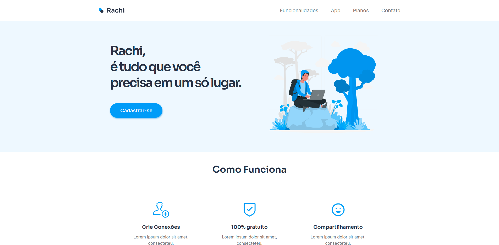

# Desafio 19 da Codelândia

### :hourglass: _Em andamento ..._

:computer: Escolhi utilizar esse desafio para treinar minhas habilidades com **React, Styled Components e Typescript**.

### Layout: [Figma](https://www.figma.com/file/Yb9IBH56g7T1hdIyZ3BMNO/Desafios---Codel%C3%A2ndia?node-id=41733%3A754)

## [Click here to check it live / Clique para ver o site](https://rachi-challenge.netlify.app/)

## MVP:

(x) Desktop Version  
( ) Mobile Version

## Social Media Links | Let's Connect!

[Twitter](https://www.twitter.com/marcell0lopes)
 
[Linkedin](https://www.linkedin.com/in/marcellolopes30)
 
[Codepen](https://www.codepen.io/marcell0lopes)
 
